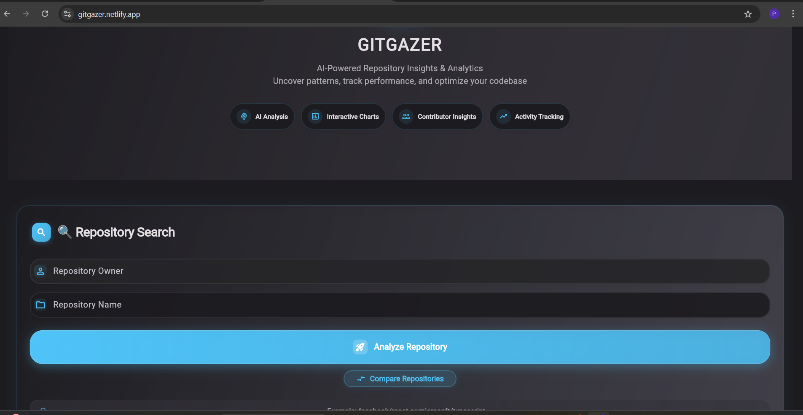
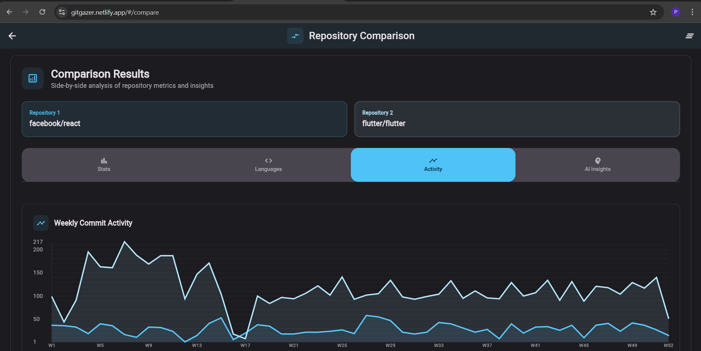

# 🔍 **GITGAZER**

**Track: Progressive Web App (PWA) - Flutter Implementation**

> 🌐 **Live PWA**: [**GITGAZER - Try it Now!**](https://gitgazer.netlify.app)  

## 🎥 Demo Video

[](https://youtu.be/Ep_Dd_t0m-4)

*Click the thumbnail above to watch the 3-minute demo showcasing all features*

A comprehensive Flutter-based Progressive Web App for analyzing GitHub repositories with AI-powered insights. This project demonstrates that Flutter can achieve the same PWA capabilities as traditional web frameworks.

## 📱 Screenshots & Demo

### Desktop Experience

*GITGAZER's modern hero section with glassmorphism effects and advanced animations*


*Comprehensive repository analysis dashboard with interactive charts*


*Side-by-side repository comparison with detailed metrics and visualizations*

## ✨ Key Features

### PWA Capabilities
- ✅ **Installable**: Full PWA manifest with proper icons and metadata
- ✅ **Offline Support**: Workbox service worker for comprehensive caching
- ✅ **Cross-Platform**: Works on desktop, mobile, and tablet devices

### Core Functionality
- **🔖 Smart Bookmarks System**: Save and organize favorite repositories with Hive local database
- **🏷️ Tag Management**: Organize bookmarks with custom tags and smart filtering
- **🔍 Advanced Search**: Search through bookmarks with intelligent filtering
- **🤖 AI-Powered Analysis**: Intelligent repository insights and descriptions
- **📊 Interactive Visualizations**: Custom charts for language breakdown and commit activity
- **📈 Real-time Statistics**: Comprehensive repository metrics and trending data
- **⚔️ Repository Comparison**: Side-by-side analysis of multiple repositories with detailed metrics
- **🎨 Material 3 Design**: Modern dark theme with glassmorphism effects
- **✨ Advanced Animations**: Particle systems, floating elements, and smooth transitions
- **💾 Offline-First Architecture**: Local data storage with Hive for offline capabilities

## 🛠️ Technology Stack

### Frontend & PWA
- **Framework**: Flutter 3.x with Dart for cross-platform development
- **PWA**: Workbox service worker for comprehensive caching and offline functionality
- **Design System**: Material 3 with custom dark theme and glassmorphism effects
- **Animations**: Custom particle systems, floating elements, and advanced animations

### State Management & Data
- **State Management**: Provider pattern for reactive UI updates
- **Local Database**: Hive for fast, type-safe local storage and offline capabilities
- **Data Models**: Custom type adapters for efficient serialization
- **Offline-First**: Local caching with smart synchronization

### Visualization & UI
- **Charts**: Custom-built interactive visualization components (FL Chart)
- **Typography**: Google Fonts with Material 3 typography scale
- **Icons**: Font Awesome Flutter and Material Icons
- **Responsive Design**: Mobile-first with adaptive layouts

### Backend Integration
- **API**: GitHub Analyzer Backend (https://github-analyzer-backend-g300.onrender.com)
- **HTTP Client**: Dart HTTP package with error handling
- **GitHub API**: Direct integration for real-time repository data

## 🚀 Local Development Setup

### Prerequisites
- Flutter SDK 3.1.0+
- Web Browser (Chrome recommended)

### Installation
```bash
# Clone repository
git clone https://github.com/PRIYUNSHU21/GITGAZER.git
cd GITGAZER

# Install dependencies
flutter pub get

# Generate Hive type adapters
flutter packages pub run build_runner build

# Run development server
flutter run -d chrome --web-port 3000

# Build for production
flutter build web --release

# Generate PWA service worker
npx workbox generateSW workbox-config.js
```

### Quick Deployment
```bash
# Use the automated deployment script
./deploy.bat     # Windows
./deploy.sh      # Linux/Mac
```

## 📱 How to Use

### 1. **Repository Analysis**
- Enter **Owner** (e.g., `facebook`) and **Repository name** (e.g., `react`)
- View comprehensive analysis with AI insights, statistics, and visualizations
- **Bookmark** repositories using the bookmark button for quick access later

### 2. **Bookmark Management**
- Click the **floating bookmark button** on home screen or **bookmark icon** in analysis
- **Search and filter** bookmarks by name, description, or custom tags
- **Organize** with custom tags like "Learning", "Work", "Inspiration"
- **Quick navigation** back to any bookmarked repository analysis

### 3. **Repository Comparison**
- Compare multiple repositories side-by-side with detailed metrics and charts
- View language distribution, commit activity, and statistical comparisons
- Export comparison data for further analysis

### 4. **PWA Installation**
- Use browser's **"Add to Home Screen"** for native app-like experience
- Works **offline** with cached data and bookmarks
- **Cross-platform** support (desktop, mobile, tablet)

### Example Repositories
- `facebook/react` - React JavaScript library
- `microsoft/vscode` - Visual Studio Code
- `flutter/flutter` - Flutter framework

## 🔖 **NEW: Smart Bookmarks System**

### Features
- **📚 Local Storage**: Fast Hive database for offline bookmark management
- **🏷️ Smart Tagging**: Organize bookmarks with custom tags like "Learning", "Work", "Inspiration"
- **🔍 Advanced Search**: Search bookmarks by name, description, language, or tags
- **📊 Rich Metadata**: Store repository stats, language, stars, forks, and descriptions
- **⚡ Quick Access**: Floating action button and dedicated bookmarks screen
- **💾 Offline-First**: Works completely offline with local data persistence
- **📱 Cross-Platform**: Bookmarks sync across all devices using the same browser

### How It Works
1. **Bookmark**: Click bookmark button while analyzing any repository
2. **Organize**: Add custom tags to categorize your saved repositories
3. **Search**: Use the search bar and tag filters to find repositories quickly
4. **Access**: Click any bookmark to jump back to the full analysis
5. **Manage**: View, edit, or remove bookmarks from the dedicated bookmarks screen

*This feature demonstrates advanced local data management with Hive - a significant upgrade from basic SharedPreferences storage.*

## 📁 Project Structure

```
GITHUB_ANALYZER_FRONTEND/
├── lib/                           # Flutter source code
│   ├── core/
│   │   ├── constants/            # App constants, themes, and design tokens
│   │   ├── services/             # API, GitHub, and connectivity services
│   │   └── utils/                # Utilities, formatters, and validators
│   ├── models/                   # Data models and Hive type adapters
│   │   ├── repository_analysis.dart # Main analysis model
│   │   └── bookmark.dart         # Bookmark model with Hive annotations
│   ├── providers/                # State management providers
│   │   ├── bookmark_provider.dart # Hive-based bookmark management
│   │   ├── theme_provider.dart   # Theme and appearance settings
│   │   ├── history_provider.dart # Search history management
│   │   └── analysis_provider.dart # Repository analysis state
│   ├── screens/                  # App screens and navigation
│   │   ├── home_screen.dart      # Landing page with advanced hero section
│   │   ├── dashboard_screen.dart # Repository analysis dashboard
│   │   ├── bookmarks_screen.dart # Bookmark management interface
│   │   └── repository_compare_screen.dart # Repository comparison
│   ├── widgets/                  # Reusable UI components
│   │   ├── ai/                   # AI insights and enhanced cards
│   │   ├── cards/                # Stats, insights, and modern card components
│   │   ├── charts/               # Interactive charts and visualizations
│   │   ├── common/               # Loading, error, and utility widgets
│   │   ├── comparison/           # Repository comparison components
│   │   └── home/                 # Hero section with particle effects
│   │   └── home/                 # Home screen widgets
│   └── main.dart                 # App entry point
├── web/                          # PWA configuration
│   ├── index.html               # Main HTML file with PWA meta tags
│   ├── manifest.json            # PWA manifest for installability
│   ├── sw.js                    # Service worker (empty, Workbox generates)
│   └── icons/                   # PWA icons (192x192, 512x512)
├── build/                       # Production build output
│   ├── web/                     # Built web application
│   └── sw.js                    # Generated Workbox service worker
├── workbox-config.js            # Workbox service worker configuration
├── pubspec.yaml                 # Flutter dependencies
└── README.md                    # Project documentation
```

## 🏗️ Architecture & Technical Choices

### Why Flutter for PWA?
- **🎯 Single Codebase**: Write once, deploy everywhere (web, mobile, desktop)
- **⚡ Performance**: Compiled to optimized JavaScript with native performance
- **🎨 Material 3**: Native implementation of Google's latest design system
- **🔧 Developer Experience**: Hot reload, strong typing, and excellent tooling
- **💾 Local Storage**: Hive integration for fast, offline-capable data management

### PWA Implementation
- **📦 Workbox**: Industry-standard service worker for comprehensive offline caching
- **📱 Manifest**: Complete PWA configuration for native app installability
- **📐 Responsive Design**: Mobile-first with adaptive breakpoints (480px, 768px, 1024px)
- **🔄 Offline-First**: Smart caching strategy with local data persistence

### Key Technical Achievements
- **🗄️ Hive Database**: Fast, type-safe local storage replacing SharedPreferences
- **🎭 Advanced Animations**: Particle systems, glassmorphism, and smooth transitions
- **📊 Custom Charts**: Interactive visualizations built with FL Chart
- **🎨 Material 3**: Dark theme with custom color schemes and design tokens

## 📊 Repository Statistics


---

**Built with ❤️ using Flutter and Material 3**

*GITGAZER - Demonstrating that Flutter can create world-class Progressive Web Apps*
