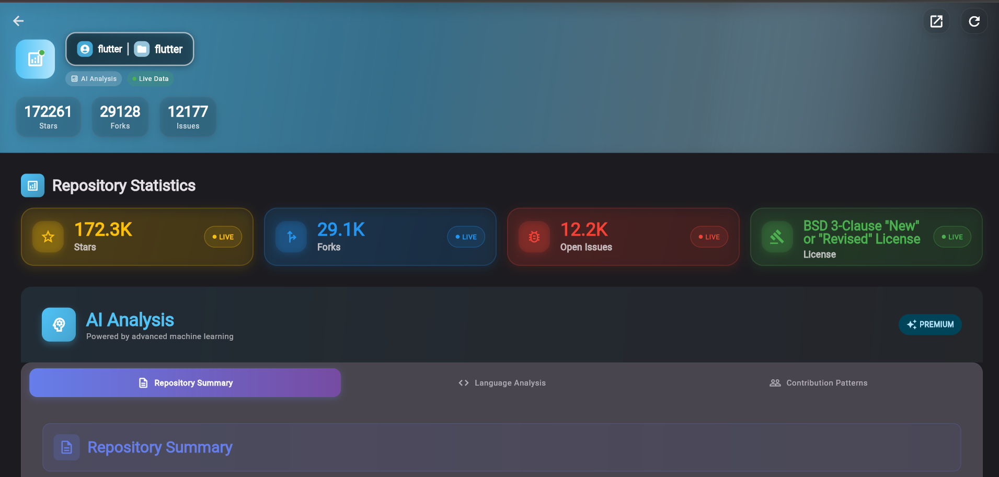

# 🔍 **GITGAZER**

**Track: Progressive Web App (PWA) - Flutter Implementation**

> 🌐 **Live PWA**: [**GITGAZER - Try it Now!**](https://gitgazer.netlify.app)  
> 🎥 **Demo Video**: [**Watch 3-Minute Demo**](https://www.youtube.com/watch?v=YOUR_VIDEO_ID)

A comprehensive Flutter-based Progressive Web App for analyzing GitHub repositories with AI-powered insights. This project demonstrates that Flutter can achieve the same PWA capabilities as traditional web frameworks.

## 📱 Screenshots & Demo

### Desktop Experience

*GITGAZER's modern hero section with glassmorphism effects and advanced animations*


*Comprehensive repository analysis dashboard with interactive charts*


*Side-by-side repository comparison with detailed metrics and visualizations*

## ✨ Key Features

### PWA Capabilities
- ✅ **Installable**: Full PWA manifest with proper icons and metadata
- ✅ **Offline Support**: Workbox service worker for comprehensive caching
- ✅ **Cross-Platform**: Works on desktop, mobile, and tablet devices

### Core Functionality
- **AI-Powered Analysis**: Intelligent repository insights and descriptions
- **Interactive Visualizations**: Custom charts for language breakdown and commit activity
- **Real-time Statistics**: Comprehensive repository metrics and trending data
- **Repository Comparison**: Side-by-side analysis of multiple repositories with detailed metrics
- **Material 3 Design**: Modern dark theme with glassmorphism effects
- **Advanced Animations**: Particle systems and smooth transitions

## 🛠️ Technology Stack

- **Framework**: Flutter 3.x with Dart
- **PWA**: Workbox service worker for caching and offline functionality
- **Design**: Material 3 with custom dark theme
- **State Management**: Provider for reactive UI updates
- **Charts**: Custom-built visualization components
- **Backend**: GitHub Analyzer API (https://github-analyzer-backend-g300.onrender.com)

## 🚀 Local Development Setup

### Prerequisites
- Flutter SDK 3.1.0+
- Web Browser (Chrome recommended)

### Installation
```bash
# Clone repository
git clone https://github.com/YOUR_USERNAME/REPOSITORY_NAME.git
cd github-analyzer-frontend

# Install dependencies
flutter pub get

# Run development server
flutter run -d chrome --web-port 3000

# Build for production
flutter build web --release
```

## 📱 How to Use

1. **Single Repository Analysis**: Owner (e.g., `facebook`) and Repository name (e.g., `react`)
2. **Repository Comparison**: Compare multiple repositories side-by-side with metrics and charts
3. **View Analysis**: Comprehensive statistics, language breakdown, and AI insights
4. **Install PWA**: Use browser's "Add to Home Screen" for app-like experience

### Example Repositories
- `facebook/react` - React JavaScript library
- `microsoft/vscode` - Visual Studio Code
- `flutter/flutter` - Flutter framework

## 📁 Project Structure

```
GITHUB_ANALYZER_FRONTEND/
├── lib/                           # Flutter source code
│   ├── core/
│   │   ├── constants/            # App constants and themes
│   │   ├── services/             # API and GitHub services
│   │   └── utils/                # Utilities and formatters
│   ├── models/                   # Data models for API responses
│   ├── providers/                # State management providers
│   ├── screens/                  # App screens
│   │   ├── home_screen.dart      # Landing page with hero section
│   │   ├── dashboard_screen.dart # Repository analysis dashboard
│   │   └── repository_compare_screen.dart # Repository comparison
│   ├── widgets/                  # Reusable UI components
│   │   ├── ai/                   # AI insights widgets
│   │   ├── cards/                # Card components
│   │   ├── charts/               # Custom chart widgets
│   │   ├── common/               # Common UI components
│   │   ├── comparison/           # Repository comparison widgets
│   │   └── home/                 # Home screen widgets
│   └── main.dart                 # App entry point
├── web/                          # PWA configuration
│   ├── index.html               # Main HTML file with PWA meta tags
│   ├── manifest.json            # PWA manifest for installability
│   ├── sw.js                    # Service worker (empty, Workbox generates)
│   └── icons/                   # PWA icons (192x192, 512x512)
├── build/                       # Production build output
│   ├── web/                     # Built web application
│   └── sw.js                    # Generated Workbox service worker
├── workbox-config.js            # Workbox service worker configuration
├── pubspec.yaml                 # Flutter dependencies
└── README.md                    # Project documentation
```

## 🏗️ Architecture & Technical Choices

### Why Flutter for PWA?
- **Single Codebase**: Write once, deploy everywhere
- **Performance**: Compiled to optimized JavaScript
- **Material 3**: Native implementation of latest design standards
- **Developer Experience**: Hot reload and strong typing

### PWA Implementation
- **Workbox**: Industry-standard service worker for offline caching
- **Manifest**: Complete PWA configuration for installability
- **Responsive Design**: Mobile-first with 768px and 480px breakpoints

## 📊 Repository Statistics


---

**Built with ❤️ using Flutter and Material 3**

*GITGAZER - Demonstrating that Flutter can create world-class Progressive Web Apps*
